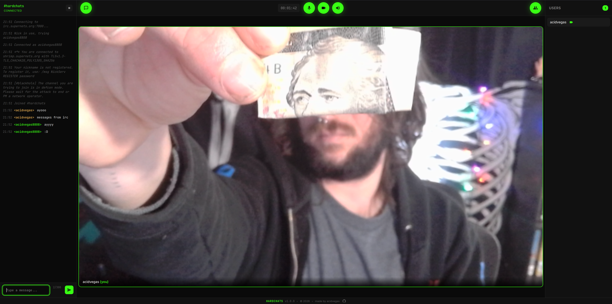

# HARDCHATS




## Setup

#### NGINX setup

###### Create a certificate
```bash
sudo certbot certonly --standalone -d hardchats.com
```

###### Create an NGINX config
```bash
sudo nano /etc/nginx/sites-available/hardchats.com.conf
```

```
server {
    listen 80;
    listen [::]:80;
    server_name dev.hardchats.com;

    return 301 https://$host$request_uri;
}

server {
    listen 443 ssl http2;
    listen [::]:443 ssl http2;
    server_name dev.hardchats.com;

    ssl_certificate     /etc/letsencrypt/live/hardchats.com/fullchain.pem;
    ssl_certificate_key /etc/letsencrypt/live/hardchats.com/privkey.pem;

    location / {
        proxy_pass http://127.0.0.1:58080;
        proxy_http_version 1.1;

        proxy_set_header Host $host;
        proxy_set_header X-Real-IP $remote_addr;
        proxy_set_header X-Forwarded-For $proxy_add_x_forwarded_for;
        proxy_set_header X-Forwarded-Proto $scheme;

        proxy_set_header Upgrade $http_upgrade;
        proxy_set_header Connection "upgrade";
    }
}
```

```bash
sudo ln -sf /etc/nginx/sites-available/hardchats.com.conf /etc/nginx/sites-enabled/
sudo nginx -t && sudo systemctl reload nginx
```

#### UnrealIRCd setup

###### Create a listen block for websocket connections over TLS
```
listen {
    ip *;
    port 7000;
    options {
        tls;
        websocket { type text; }
    };
    tls-options {
        certificate "tls/irc.crt";
        key "tls/irc.key";
		options { no-client-certificate; }
    };
};
```

###### Load required modules

```
loadmodule "webserver";
loadmodule "websocket";
loadmodule "websocket_common";
```

## Roadmap
###### Features
- [ ] End-to-end encryption
- [ ] Low bandwidth mode

###### Bugs
- [ ] Mute indiactors are not work. They sync on first connect but when someone (un)mutes, it does not detect it.
- [ ] When you try to click something in the users menu, if someone speaks and hilights their name, it hijacks the click in the users menu *(reported by bombuzal)*
- [ ] Trying to copy text in the chat box does not work as it activates the hotkey to hide/show the chat.
- [ ] When a person closes their tab, their user is not instantly removed from the user list. Console shows an attempt at renegotiating. Need to make it instant.
- [ ] Names have to start with a letter because IRC wont allow names starting with a number

###### Mobile Issues
- [ ] Hide the screen share button on mobile as it is pointless.
- [ ] Dont start with user list open by default on mobile
- [ ] Mobile users when they have someone maximized should see a horizontally scrolling list on the bottom of other cameras still, like how desktop mode does it.
- [ ] Mobile users need to be able to fit all video tiles on the screen dynamically resizing it as the grid grows.


###### Touchups
- [ ] IRC channel +H history loading on connection
- [ ] Cleaner IRC chat *(hide server notices and redundant content)*
- [ ] Better captcha system to prevent bot abuse
- [ ] Add a TEST button for the audio device selected in the user settings menu.
- [ ] Move debug buton into user settings
- [ ] Remove defcon/screen share hotkeys, add `shift+M` to mute sounds hotkey.
- [ ] Hang up button to close the tab
- [ ] User list & chatbox should be full sized when toggled on or off.
- [ ] Add `_` and `-` to allowed chars.


###### Fancy Pipe Dreams
- [ ] Improve debug menu to show resource utilization of ram, cpu, inbound and outbound traffic, network information, connected duration, better live logs, able to toggle debug mode on or off to retain the last 5000 lines of logs so you can conduct actions when closing the debug menu and check back on the debug logs afterwards.
- [ ] Option in the settings menu to turn on no-cam tile mode, where all users have a box on the screen, even if they are not on camera *(Remembered via cookies)*
- [ ] Color picker to replace the green accent with your own color choice *(Remembered via cookies)*
- [ ] Milkdrop animations from the audio *(either background or for no-cam tile mode when people speak)*
- [ ] Multiple room support + lobby system

## Contribute
Come join us on `irc.supernets.org` in `#hardchats` for testing, feedback, & collaboration!

---

###### Mirrors: [acid.vegas](https://git.acid.vegas/hardchats) • [SuperNETs](https://git.supernets.org/acidvegas/hardchats) • [GitHub](https://github.com/acidvegas/hardchats) • [GitLab](https://gitlab.com/acidvegas/hardchats) • [Codeberg](https://codeberg.org/acidvegas/hardchats)
