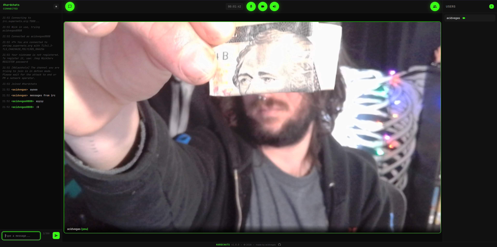

# HARDCHATS



## About
HARDCHATS is a lightweight voice & video chat platform for small groups. It runs entirely through a self-hosted [coturn](https://github.com/coturn/coturn) TURN relay rather than direct peer-to-peer, so participants never expose their IPs to each other. There's an optional IRC sidebar that bridges into a regular IRC channel for text chat.

It's intentionally admin-less - there are no moderators, no roles, no kicks, no bans. The room is self-moderated by whoever's in it. To keep that workable, the client ships with a couple of safety levers:

## Setup

#### NGINX setup

###### Create a certificate
```bash
sudo certbot certonly --standalone -d hardchats.com
```

###### Create an NGINX config
```bash
sudo nano /etc/nginx/sites-available/hardchats.com.conf
```

```
server {
    listen 80;
    listen [::]:80;
    server_name dev.hardchats.com;

    return 301 https://$host$request_uri;
}

server {
    listen 443 ssl http2;
    listen [::]:443 ssl http2;
    server_name dev.hardchats.com;

    ssl_certificate     /etc/letsencrypt/live/hardchats.com/fullchain.pem;
    ssl_certificate_key /etc/letsencrypt/live/hardchats.com/privkey.pem;

    location / {
        proxy_pass http://127.0.0.1:58080;
        proxy_http_version 1.1;

        proxy_set_header Host $host;
        proxy_set_header X-Real-IP $remote_addr;
        proxy_set_header X-Forwarded-For $proxy_add_x_forwarded_for;
        proxy_set_header X-Forwarded-Proto $scheme;

        proxy_set_header Upgrade $http_upgrade;
        proxy_set_header Connection "upgrade";
    }
}
```

```bash
sudo ln -sf /etc/nginx/sites-available/hardchats.com.conf /etc/nginx/sites-enabled/
sudo nginx -t && sudo systemctl reload nginx
```

#### UnrealIRCd setup

###### Create a listen block for websocket connections over TLS
```
listen {
    ip *;
    port 7000;
    options {
        tls;
        websocket { type text; }
    };
    tls-options {
        certificate "tls/irc.crt";
        key "tls/irc.key";
		options { no-client-certificate; }
    };
};
```

**Note:** The `no-client-certificate` is required to allow Chrome based browsers to connect. This is not required for Firefox though.

###### Load required modules

```
loadmodule "webserver";
loadmodule "websocket";
loadmodule "websocket_common";
```

## Contribute
Come join us on `irc.supernets.org` in `#hardchats` for testing, feedback, & collaboration!

---

###### Mirrors: [acid.vegas](https://git.acid.vegas/hardchats) • [SuperNETs](https://git.supernets.org/acidvegas/hardchats) • [GitHub](https://github.com/acidvegas/hardchats) • [GitLab](https://gitlab.com/acidvegas/hardchats) • [Codeberg](https://codeberg.org/acidvegas/hardchats)
